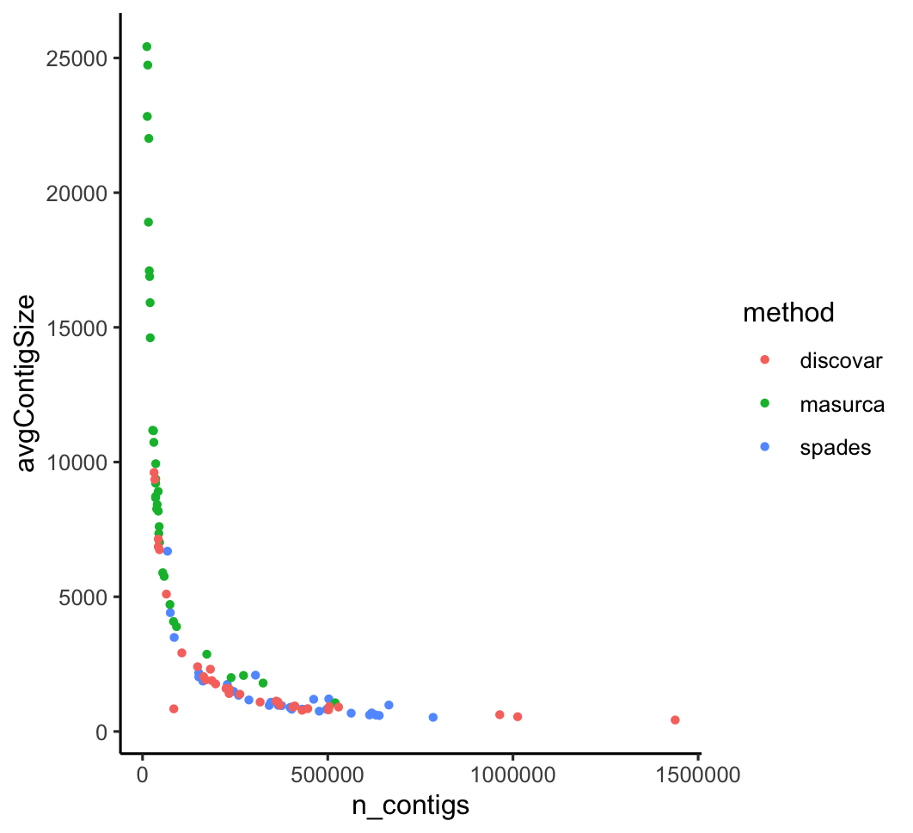
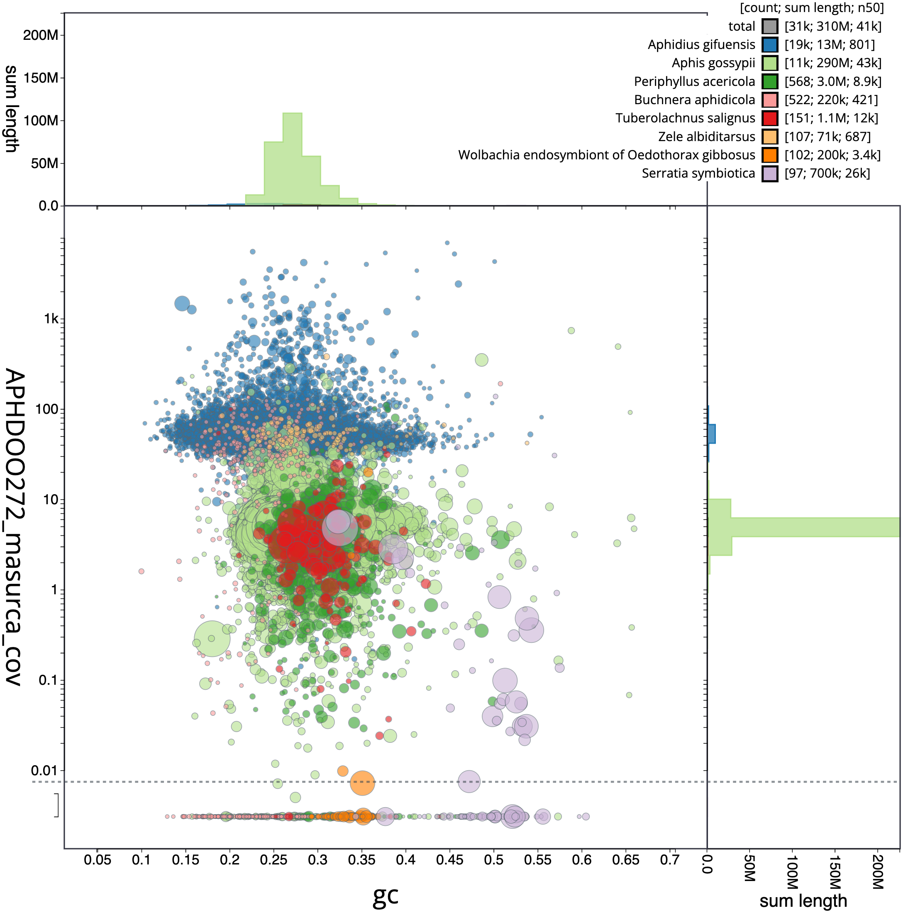
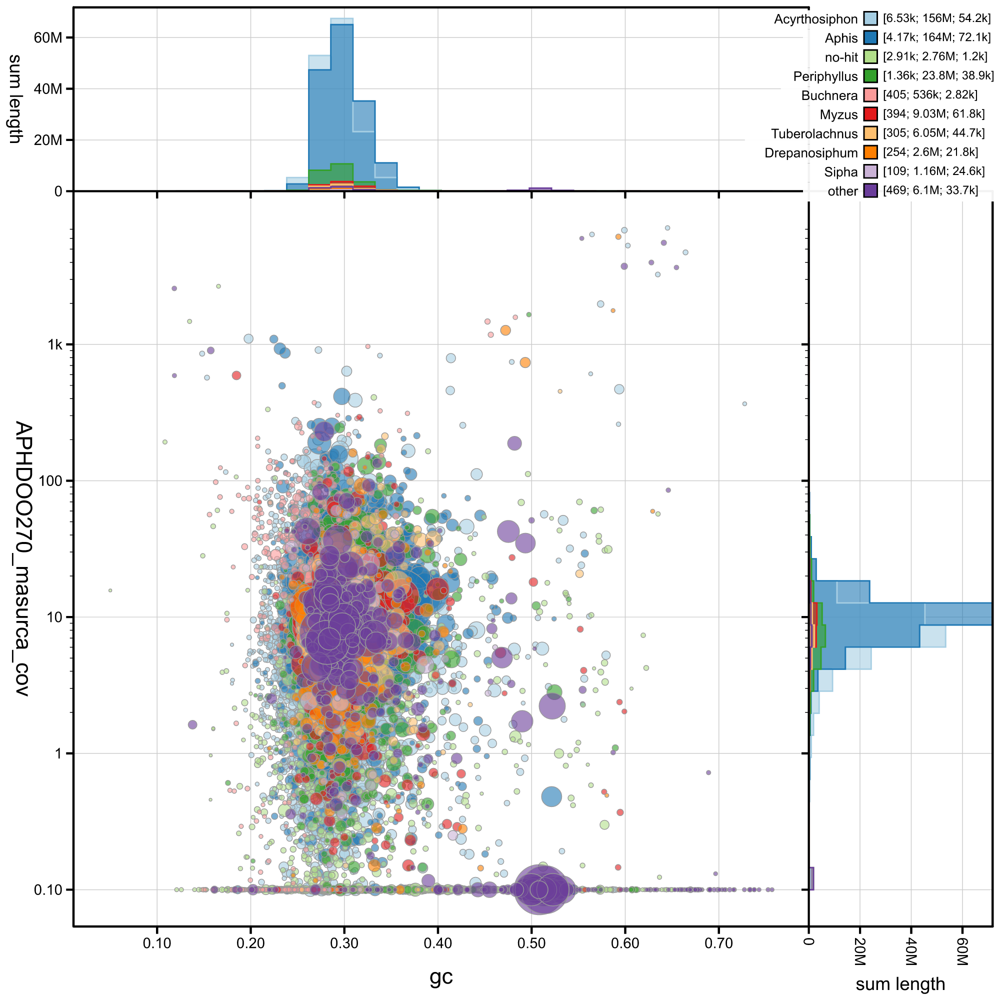
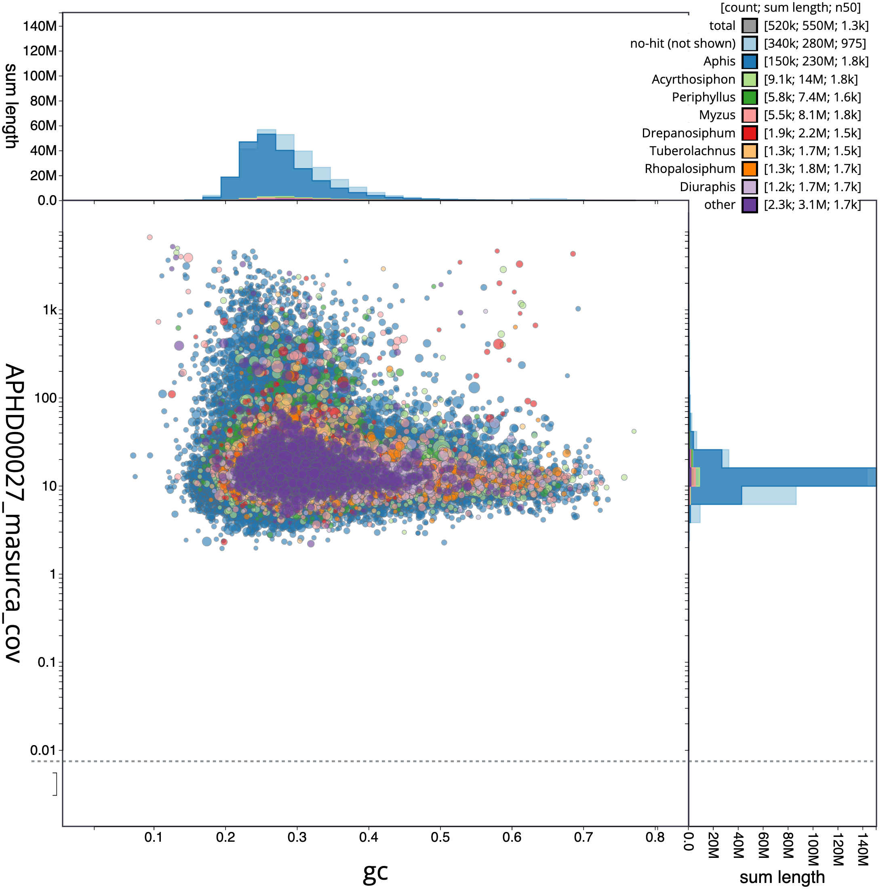

# Using Blobtools to check for contamination

Towards the beginning of this project, I discovered that APHD00272AAUR was not coming out in the right part of the tree bc it was parasitized. I want to use blobtools to see if I can separate the parasitized sequences from the aphid sequences. Thomas Mathers did something similar in this [G3 paper](https://academic.oup.com/g3journal/article/10/3/899/6026189).

I am also hoping I can use blobtools to see if there has been some contamination in the APHD00027ASPnl2 and APHD00270ASPlk specimens which were morphologically identified as *Myzus ascalonius* and *Myzus varians*, but the mitochondria shows up as Aphis.

To do this:
* First we need assemblies. Thomas Mathers recommended I do this with [discovar](https://github.com/broadinstitute/discovar_de_novo). He says this works well with aphids and illumina short reads.
* First I will transfer the raw reads over to CERES is down. I'll transfer first 272, 27, and 270, although I'm curious about doing it with all of them. I will also transfer Phorodons and another outgroup.
* I need to download the [DiscovarDenovo using conda](https://bioconda.github.io/recipes/discovar-denovo/README.html). On an interactive node, do `module load miniconda`, activate a conda environment `source activate /project/aphid_phylogenomics/yelena/yelenaConda/` (It kept giving me an error that I don't have write permissions in this environment, so I got yelena to create it. Hopefully this works. It worked on atlas when I did `conda create --name discovarenv discovardenovo`). Then use the command: `mamba install discovardenovo`. Mamba is a faster version of conda that is usually better at resolving packages. 
* DISCOVARdenovo should be run on raw reads, without any filtering.
* I think the files need to be unzipped
* Make a file called namelist.txt that has the prefixes we want to do. `for f in *R1*.gz; do fprefix=${f%%_*}; echo $fprefix; done > namelist.txt`
* I ran the assembly via this [slurm script](scripts/discovar_atlas.sh) on Atlas. Each of these took between 80 and 260 minutes.
   * From Thomas: `DiscovarDeNovo READS=M_lig_095_R1_val_1.fq,M_lig_095_R2_val_2.fq OUT_DIR=. NUM_THREADS=32 MAX_MEM_GB=100`
* How many reads per fastq file? `for file in *.fastq; do echo $file; echo $(cat $file|wc -l)/4|bc; done.` This info is also in the output files.
* Assembly stats: `for d in APHD*/; do echo $d; cat $d/a.final/stats; done >allstats.txt`
* Move all the discovar things to a separate directory
* Copy the fragment size files to computer to look at them. First make a directory called fragsdist, then run `for f in APHD*/frags.dist.png; do echo $f; newf=${f%%/*}; cp $f fragsdist/${newf}.png; done`, then copy to computer.
* I got errors doing the blastn step to get taxonomy. I'll try installing my own blast through conda. Load miniconda, then `source activate discovarenv`. This didn't work: transfering files back over to ceres.
* On Ceres, run [blobblast.sh](scripts/blobblast.sh). This should generate a bunch of files that end in megablast_nt. This took about 1279 minutes on average (21 hours). 
* Activate discovarenv. Install blobtools with `conda install bioconda::blobtools`.
* Run [blobdb.sh](scripts/blobdb.sh). This is giving me errors saying it requires --names, --nodes or --db. I think something is wrong. Maybe it's my coverage file?
*I'll use bowtie2 to map sequences back to mapping files. [bowtie2.sh](scripts/bowtie2.sh)

### Assemblies with masurca
* I'm going to also try making assemblies with masurca and see how it compares.
* First make a directory called masurca. It doesn't like how I'm using wildcards, so I'm going to make files with full lists of file addresses. `ls /90daydata/aphid_phylogenomics/becca/raw_data/shotgunseqs/*R1*fastq.gz >namelistf.txt`
* worked
* Use the [assemblathon script](https://github.com/ISUGIFsingularity/utilities/blob/master/utilities/new_Assemblathon.pl) to calculate some statistics. First do `module load perl`. Then do: `perl new_Assemblathon.pl final.genome.scf.fasta`. Use the [masurca_stats.sh](scripts/masurca_stats.sh) file.
* Use `python ~/scripts/contig_table_assemblathon.py` to combine separate assemblathon stats things into one csv file.

### Assemblies with Spades
* Only 23/34 of samples worked. APHD00027 didn't finish. Neither did APHD00041. 41 finished abnormally with OS return value 255 (cannot allocate memory-it used 108G). 27 finished also out of memory--it had 73G at the end. I'll try running these two again. Are they the biggest? 41 isn't. I allocated more memory then started those two samples again.
* Quantify these using [contig_stats.pl](https://github.com/KorfLab/Perl_utils/blob/master/contig_stats.pl). On an interactive node, load the perl module, then do `for f in APHD*/contigs.fasta; do echo $f >> contig_stats.txt; perl ../scripts/contig_stats.pl $f >> contig_stats.txt; done`
* Then use [contig_table.py](scripts/contig_table.py) to convert text file to tab separated output. [Here's](https://docs.google.com/spreadsheets/d/1lA_A7v1McQYVXbxUdtAB53EJPoQIcvBhJ5BX2rukXvc/edit#gid=1651959159) the results.
* Load miniconda. Then combine the files into a single csv file using [contig_table_assemblathon.py](scripts/contig_table_assemblathon.py) `python contig_table_assemblathon.py`.


## Comparing assemblies
I used R to compare the [assembly stats](scripts/comparing_assemblies.r). Masurca seemed to have the best assemblies (longest contigs, highest N50 length). So we'll continue with those assemblies.



* Next, I'm running [blobtax.sh](scripts/blobtax.sh) to blast and get the taxonomy.
* Then I'm using minimap2 with [blobcov.sh](scripts/blobcov.sh) to get the coverage for the scaffolds. This step took between 40 and 352 minutes and resulted in bam files.
* I installed with [these instructions](https://blobtoolkit.genomehubs.org/blobtools2/blobtools2-tutorials/getting-started-with-blobtools2/) using conda. `conda create -n blobtools2 -y python=3.6 docopt pyyaml ujson pysam tqdm nodejs seqtk` then `source activate blobtools2`
* I couldn't get it to actually run so I used the module on ceres and `blobtools add --create newdir --fasta blobtools2/examples/assembly.fasta --cov blobtools2/examples/assembly.reads.bam --hits blobtools2/examples/blast.out`
* You have to create first. Make sure you have the taxdump downloaded `curl -L ftp://ftp.ncbi.nih.gov/pub/taxonomy/new_taxdump/new_taxdump.tar.gz | tar xzf -`.
* Use [blobdb.sh](scripts/blobdb.sh) to run. This takes only a few minutes and generates 5 .json files. Make sure it makes the meta.json file. You need this.
* It also makes some .png files
* Now, transfer the files to your local desktop, install blobtoolkit
* Th PDF files didn't work so I'm going to try following [this tutorial](https://bga23.org/btk-cli/materials/#details) for installation. I installed micromamba, then did `micromamba create -n btk -c conda-forge python=3.9 -y` then used `micromamba activate btk` then `pip install "blobtoolkit[full]"`
* Then to host I use `blobtools host ~/Documents/aphis_myzus_hybridization/blobtools/APHD00002` to view it in the interactive browser!
* 

Here's a sample that has contamination:


and the two that are questionable:





* Finally, I'd like to filter out any fasta sequences that map to hymenoptera or have coverage higher than expected. [Here's](https://blobtoolkit.genomehubs.org/blobtools2/blobtools2-tutorials/filtering-a-dataset/) some instructions.

Scripts from Thomas Mathers:
```
### Generate blob plot of assembly (scaffs > 1Kb).
## Alternative run with megablast - can’t use diamond blast results as it does not output taxonomy. 
[matherst@TGAC-HPC kat_unfiltered_assembly]$ submit-slurm_v1.1.pl -q tgac-long -m 16000 -c 16 -t 3-00:00 -e -j M_var_vs_nt_megablast -i "source blast-2.2.31;blastn -task megablast -query a.lines.min_1kb.fasta -db /tgac/references/databases/blast/nt_28022016/nt -outfmt '6 qseqid staxids bitscore std sscinames sskingdoms stitle' -culling_limit 5 -num_threads 16 -evalue 1e-25 -out a.lines.min_1kb.megablast_nt"

# Generate blobDB
[matherst@TGAC-HPC kat_unfiltered_assembly]$ submit-slurm_v1.1.pl -q tgac-long -m 8000 -c 4 -t 2-00:00 -e -j M_var_blob_create_geablast_nt -i "source samtools-1.3;source blobtools-0.9.19;blobtools create -i a.lines.min_1kb.fasta -c M_var_232_to_a.lines.min_1kb.sorted.bam.cov -t a.lines.min_1kb.megablast_nt -o M_var_megablast_nt"
## Make output tables at genus, order and phylum level of taxonomy
[matherst@TGAC-HPC kat_unfiltered_assembly]$ submit-slurm_v1.1.pl -q tgac-long -m 8000 -c 4 -t 1-00:00 -e -j M_var_blob_view_megablast_nt -i "source samtools-1.3;source blobtools-0.9.19;blobtools view -i M_var_megablast_nt.blobDB.json -r genus -o genus"

[matherst@TGAC-HPC kat_unfiltered_assembly]$ submit-slurm_v1.1.pl -q tgac-long -m 8000 -c 4 -t 1-00:00 -e -j M_var_blob_view_megablast_nt -i "source samtools-1.3;source blobtools-0.9.19;blobtools view -i M_var_megablast_nt.blobDB.json -r order -o order"
[matherst@TGAC-HPC kat_unfiltered_assembly]$ submit-slurm_v1.1.pl -q tgac-long -m 8000 -c 4 -t 1-00:00 -e -j M_var_blob_view_megablast_nt -i "source samtools-1.3;source blobtools-0.9.19;blobtools view -i M_var_megablast_nt.blobDB.json -r phylum -o phylum"

# Make blob plots at genus, order and phylum level. Will run each with png and pdf output. 
[matherst@TGAC-HPC kat_unfiltered_assembly]$ blobtools blobplot -i M_var_megablast_nt.blobDB.json -r order -o blobPlot_order
# Phylum
[matherst@TGAC-HPC kat_unfiltered_assembly]$ blobtools blobplot -i M_var_megablast_nt.blobDB.json --format pdf -r phylum -o phylum
```
