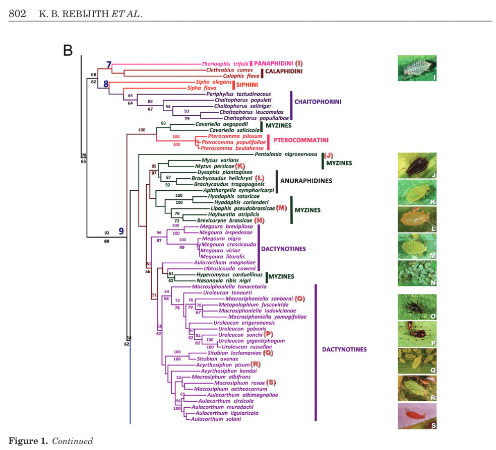
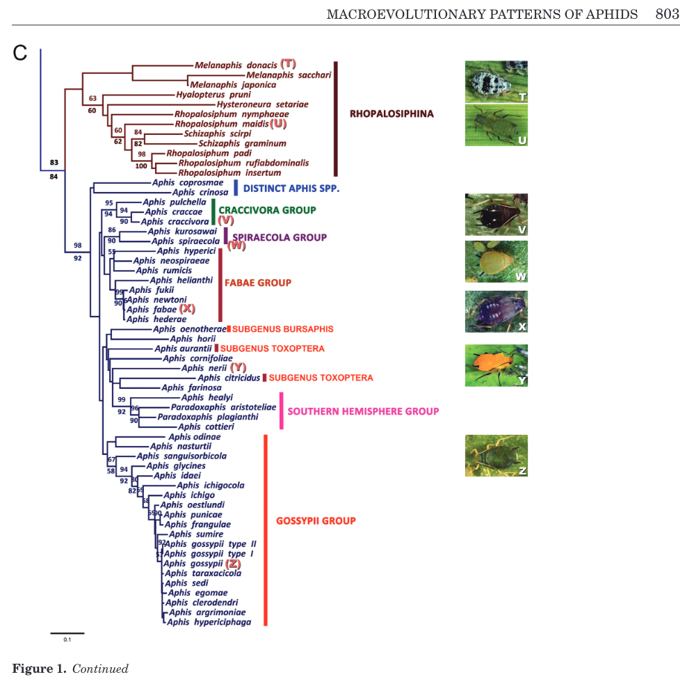
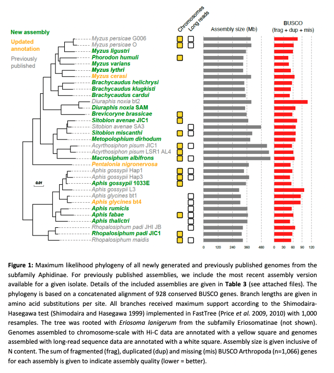

# Interpretting Orthofinder results

The first thing to do is get some idea of how your run went. In the Orthofinder folder, use the commmand `cat Comparative_Genomics_Statistics/Statistics_Overall.tsv` to take a look at some of the statistics for the run. For *Aphis*, it looks something like this:

```
Number of species	4
Number of genes	92101
Number of genes in orthogroups	87530
Number of unassigned genes	4571
Percentage of genes in orthogroups	95.0
Percentage of unassigned genes	5.0
Number of orthogroups	16961
Number of species-specific orthogroups	1242
Number of genes in species-specific orthogroups	4534
Percentage of genes in species-specific orthogroups	4.9
Mean orthogroup size	5.2
Median orthogroup size	4.0
G50 (assigned genes)	5
G50 (all genes)	5
O50 (assigned genes)	4839
O50 (all genes)	5296
Number of orthogroups with all species present	10799
Number of single-copy orthogroups	6893
Date	2022-10-11
Orthogroups file	Orthogroups.tsv
Unassigned genes file	Orthogroups_UnassignedGenes.tsv
Per-species statistics	Statistics_PerSpecies.tsv
Overall statistics	Statistics_Overall.tsv
Orthogroups shared between species	Orthogroups_SpeciesOverlaps.tsv
```

95% of our 92101 genes were assigned to orthogroups! (Fewer than 80% is problematic)

## Difference between raw and LPTG files

| --- | Aphis_all | Aphis_LPTG | Myzus_all | Myzus_LPTG |
| --- | --- | --- | --- | --- | 
| Number of taxa | 4 | 4 | 5 | 5 |
| Number of genes | 92101 | 83379 | 119918 | 110955 |
| Percent of genes in orthogroups | 95.0 | 94.6 | 94.0 | 93.2 |
| Number of orthogroups | 16961 | 16265 | 18629 | 17481 |
| Number of orthogroups with all species present | 10799 | 10560 | 10553 | 10176 |
| Number of single-copy orthogroups | 6893 | 8631 | 6203 | 7064 |

Genomes that include only the LTPG (longest transcript per gene) have fewer total genes, and a slightly smaller percent added to orthogroups, fewer orthgroups and fewer orthogroups with all species present. However, there are more single-copy orthogroups. 

We can also look at the per species statistics using cat `aa_LTPG/OrthoFinder/Results_Oct11/Comparative_Genomics_Statistics/Statistics_PerSpecies.tsv` and find that all the species have at least 90% of their genes in orthogroups.

# Species trees

You can download and look at a tree using a tree, viewer. However, for now, since it's only a few species, we'll just look at the file `cat ../aphis/aa_LTPG/OrthoFinder/Results_Oct11/Species_Tree/SpeciesTree_rooted.txt`. We find that `((Aphis_glycines:0.0505149,Aphis_gossypii:0.0328713)0.759754:0.019426,(Aphis_thalictri:0.0549169,Aphis_fabae:0.0487621)0.759754:0.019426);`

This tells us that *A. glycines* is sister to *A. gossypii* and *A. thalictri* is sister to *A. fabae*. Let's check this relationship with the literature.

For *Myzus*, we find: `((Myzus_cerasi:0.0494855,Myzus_lythri:0.0502962)0.706958:0.0138003,(Myzus_varians:0.0488933,(Myzus_persicae:0.0312069,Myzus_ligustri:0.0419441)0.630307:0.0233248)0.706958:0.0138003);`
*M. cerasi* and *M. lythri* are sister to each other, and together are sister to the group that includes the other three, with *M. persicae* and *M. ligustri* sister to each other and *M. varians* sister to them both.

<details>
<summary> Myzus tree</summary>
<br>

  
  
</details>

<details>
<summary>Aphis tree</summary>
<br>

  
  
</details>

<details>
<summary> Mathers genomic tree</summary>
<br>

  
  
</details>

The Rebijith et al. tree doesn't have enough of the taxa, but the Mathers tree has the same relationships we found with our tree.

Next: [Setup to run HybPiper](hybpiper_setup.md)
