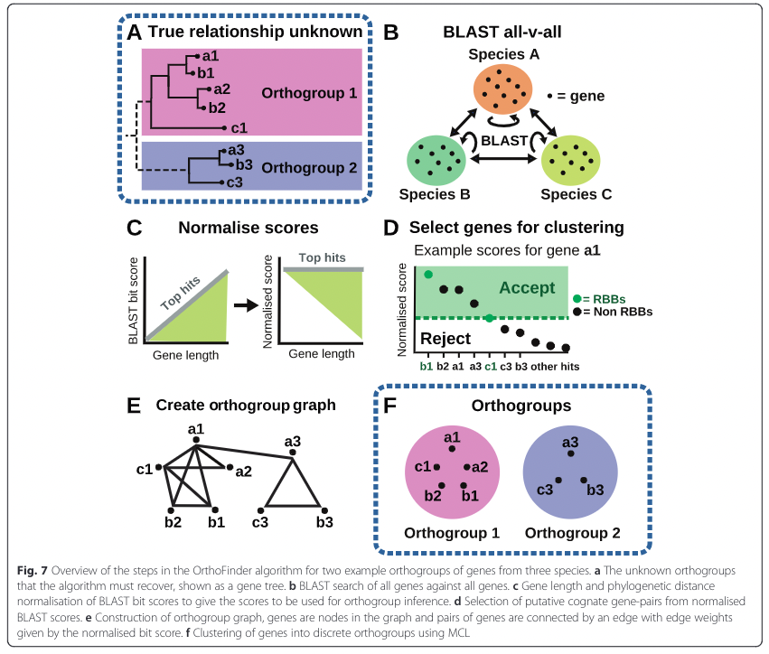

# Finding orthologs

To build a tree using genome data, first we need to find a set of orthologous genes that will make an informative tree. It is fairly easy to find genes that are homologous, or being derived from a single gene. But it is more difficult to know if two segments of DNA have shared ancestry because of a speciation event (ortholog) or a duplication event (paralogs).

To find orthologs, we will use a software called Orthofinder.

