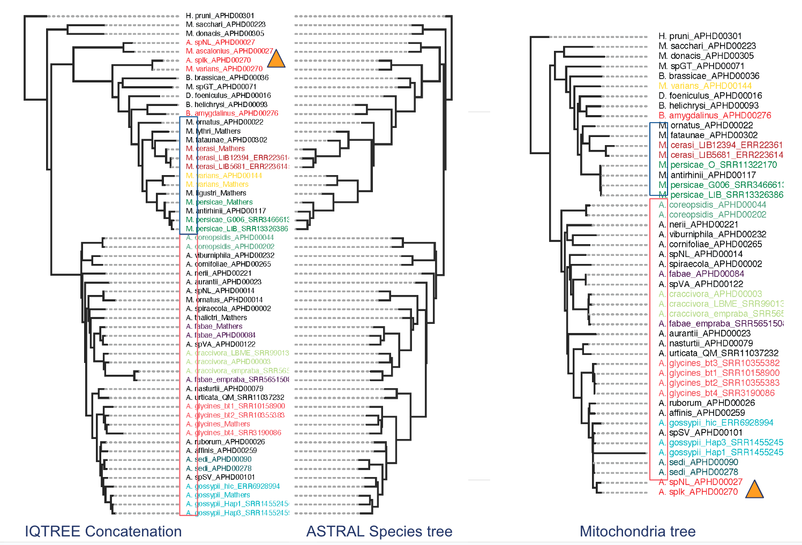
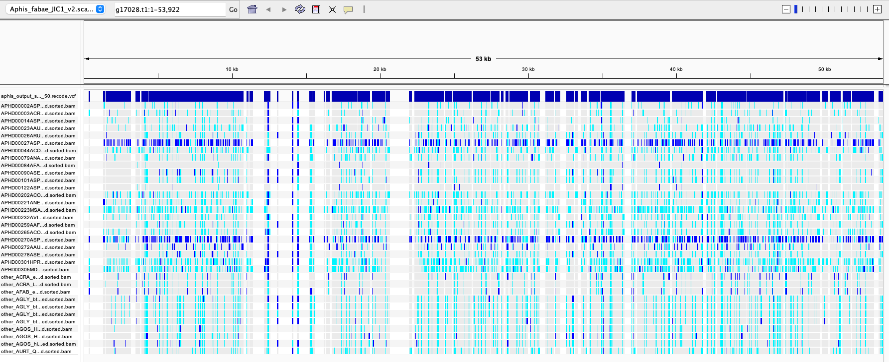

# Possible *Aphis/Myzus* hybrids

In our analyses, a few specimens have given me trouble. 

APHD00027ASPnl2 was first identified as Myzus ascalonicus, and APHD00270ASPlk was first identified as Myzus varians. In the mitochondrial tree, these come out in the Aphis gossyppii clade, but in the nuclear tree, they come out as outgroups to Myzus.



Thomas Mathers didn't believe they would hybridize. He thinks it's more likely we sequenced more than one species together. He recommended I use IGV to look at the SNP files. 

This is what it looked like with Aphis:



The two mystery ones are suspiciously heterozygous. But what if we look at them when compared to other Myzus species?

I'm not sure where these files are right now, so instead I'm going to look at the vcf files to see if I can see cases where there are more then 2 options. VCF files have options that look like this: 0/1:108,0,77. In this case, the 0 indicates the reference allele, the 1 indicates the alternative allele. The PL is the likelihood of the sample being either 0/0,0/1 or 1/1.

Thomas mentioned something about concordance factors. 

Chris helped me write this script, which tests for the nearest neighbors. It returns a table of how many times each taxa was found as the closest taxon, sorted by count. It also give the average distance.

There are 1605 trees. Originally there were 5588 trees from the genes shared by aphis and myzus, 2166 of these had at least 54 tips (out of 57). After removing trees where 27,14 and 270 weren't sister to each other, there were 1605. Why would they not be sister to eachother? BC there's 2 different genes?
```
# Code from Chris
wanted_taxa = ['Mvarians_APHD00270', 'Mascalonius_APHD00027']
list27 = [] # make an empty list
with open("aphid_1605trees.tre") as f:
    for line in f:#loop through each tree (1phylo/line)
        phylo = Tree(line.rstrip())#read into ete
        # First check if the two taxa are in the tree
        if 'Mascalonius_APHD00027' in phylo.get_leaf_names():
            aphd_270_dists = {x:phylo.get_distance(x,'Mascalonius_APHD00027') for x in phylo.get_leaf_names() if x not in wanted_taxa}#dictionary of distances
            aphd_270_dists_sorted = sorted(aphd_270_dists.items(), key=lambda x: x[1], reverse=True)[-1]#sort distances and grab lowest (aka last)
            cln_vals = "\t".join([str(i) for i in aphd_270_dists_sorted])#separate the closest taxon and dist by tab
            list27.append(cln_vals)#append to list


# now make a table of the frequency of values in list27 and the average distance
table27 = pd.DataFrame(list27, columns=['closest_taxon'])
table27[['closest_taxon','distance']] = table27['closest_taxon'].str.split('\t',expand=True) # split the columns by the tab
# Get the average distance for each value in closest taxon
table27['distance'] = table27['distance'].astype(float)
table27_new=pd.DataFrame(table27.groupby('closest_taxon').size().reset_index(name='count'))
#print(table27_new)
# add a column for the average distance grouped by closest_taxon
table27_distance = table27.groupby('closest_taxon')['distance'].mean()
# Concatenate the two tables
table27 = table27_new.merge(table27_distance, on='closest_taxon', how='left')
# sort table27 by count descending
table27 = table27.sort_values(by='count', ascending=False)
print(table27)
```
The output for Mascalonius_APHD00027:
```
                 closest_taxon  count  distance
31        Dfoeniculus_APHD00016    232  0.119616
32             Hpruni_APHD00301    107  0.145368
16            Agossypii_Mathers     99  0.031687
41           Mornatus_APHD00022     95  0.124843
22              AspSV_APHD00101     68  0.049145
27      Aviburniphila_APHD00232     55  0.085360
21              AspNL_APHD00014     54  0.118022
25           Athalictri_Mathers     53  0.071386
50    other_AGOS_hic_ERR6928994     52  0.031566
20              Asedi_APHD00278     48  0.248230
49  other_AGOS_Hap3_SRR14552459     45  0.037989
30        Bhelichrysi_APHD00093     44  0.172219
28       Bamygdalinus_APHD00276     44  0.104080
15   Agossypii_Hap1_SRR14552454     42  0.032654
46              MspGT_APHD00071     41  0.110874
0            Aaffinis_APHD00259     36  0.041877
11    Aglycines_bt1_SRR10158900     30  0.105302
29         Bbrassicae_APHD00036     30  0.435491
37           Mdonacis_APHD00305     28  0.142307
48             Mvarians_Mathers     27  0.106893
19              Asedi_APHD00090     27  0.046238
18           Aruborum_APHD00026     25  0.041327
4        Acornifoliae_APHD00265     22  0.068177
47           Mvarians_APHD00144     20  0.122268
14          Agossypii_APHD00079     20  0.065802
26     Aurticata_QM_SRR11037232     18  0.054558
10            Aglycines_Mathers     17  0.063494
39            Mligustri_Mathers     16  0.115114
23              AspVA_APHD00122     16  0.091950
36              Mcerasi_Mathers     15  0.235699
24        Aspiraecola_APHD00002     14  0.158104
1           Aaurantii_APHD00023     12  0.065266
17             Anerii_APHD00221     12  0.114264
7              Afabae_APHD00084     12  0.190946
40              Mlythri_Mathers     11  0.123296
3        Acoreopsidis_APHD00202     11  0.983965
2        Acoreopsidis_APHD00044     11  0.081404
44            Mpersicae_Mathers     10  0.086840
45          Msacchari_APHD00223      9  0.090545
8                Afabae_Mathers      9  0.059017
33        Mantirhinii_APHD00117      9  0.108852
43    Mpersicae_LIB_SRR13326386      8  0.110364
9     Afabae_empraba_SRR5651508      8  0.182175
42    Mpersicae_G006_SRR3466613      7  0.078389
35   Mcerasi_LIB5681_ERR2236145      7  2.970671
12    Aglycines_bt2_SRR10355383      5  0.053947
13     Aglycines_bt4_SRR3190086      5  0.036234
5         Acraccivora_APHD00003      5  0.053630
6   Acraccivora_LBME_SRR9901306      5  0.070266
38          Mfataunae_APHD00302      4  0.080412
34  Mcerasi_LIB12394_ERR2236144      1  0.134857
```
Similar results with all 5589 gene trees:
```                   closest_taxon  count  distance
7                    APHD00016DFOE    461  0.137000
18                   APHD00101ANER    257  0.025800
2                             AGOS    228  0.021802
31                   APHD00301HPRU    225  0.140900
8                    APHD00022MORN    215  0.108411
48       other_AGOS_hic_ERR6928994    204  0.034536
47     other_AGOS_Hap3_SRR14552459    174  0.027741
30                   APHD00278ASED    166  0.096081
46     other_AGOS_Hap1_SRR14552454    157  0.031162
26                   APHD00259AAFF    120  0.036913
25                    APHD00232ASP    117  0.089178
```
The output for Mvarians_APHD00270:
```
 closest_taxon  count  distance
10        Dfoeniculus_APHD00016    590  0.067681
20           Mornatus_APHD00022    322  0.070364
9         Bhelichrysi_APHD00093    110  0.065850
7        Bamygdalinus_APHD00276     95  0.064205
25              MspGT_APHD00071     84  0.077022
27             Mvarians_Mathers     75  0.074114
18            Mligustri_Mathers     53  0.072061
8          Bbrassicae_APHD00036     44  0.092814
26           Mvarians_APHD00144     42  0.071497
23            Mpersicae_Mathers     41  0.076528
15              Mcerasi_Mathers     28  0.073459
19              Mlythri_Mathers     22  0.058208
12        Mantirhinii_APHD00117     17  0.068534
14   Mcerasi_LIB5681_ERR2236145     15  0.072638
21    Mpersicae_G006_SRR3466613     14  0.069265
17          Mfataunae_APHD00302     14  0.061950
22    Mpersicae_LIB_SRR13326386     13  0.066608
```
When I do it with all 5589 gene trees, I get similar results:
```7                    APHD00016DFOE   1764  0.081219
8                    APHD00022MORN    909  0.080085
13                   APHD00071MCER    380  0.089831
17                   APHD00093BHEL    353  0.077870
29                   APHD00276BAMY    323  0.077923
39                            MVAR    305  0.089510
11                    APHD00036DSP    232  0.093993
21                   APHD00144MVAR    184  0.082418
```
