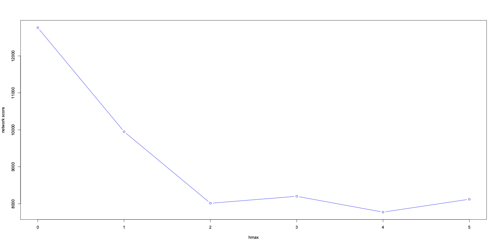

# Phylogenetic Networks

We now have both a species tree and a concatenated tree for these aphid groups. Now we can start looking for hybridization events using a network approach. One method of doing this is a software called [SNaQ](http://crsl4.github.io/PhyloNetworks.jl/latest/man/inputdata/).
* Make a directory called snaq in the aphis and myzus folder and transfer the gene tree and species tree files from the Analysis folder.
*  On an interactive node, load the julia module. Type julia to start running julia. Then press the "]" key to start the [package manager.](https://researchcomputing.princeton.edu/support/knowledge-base/julia)
```
activate "/home/<YourNetID>/.julia/project1"
add PhyloNetworks
add CSV
add DataFrames
```
* I ran into this issue when my package didn't load but [this fixes it? ](https://discourse.julialang.org/t/help-with-registry-toml-missing/49304)
* To make sure it's working, type `using PhyloNetworks;`
* Following [this tutorial](http://crsl4.github.io/PhyloNetworks.jl/latest/man/inputdata/), read in the file of gene trees with `genetrees = readMultiTopology("myzus_gene.tre");` Verify you can see one of the gene trees with `genetrees[3]`.
* Calculate the quartets in your gene trees `q,t = countquartetsintrees(genetrees);` and put it in a data frame `df = writeTableCF(q,t)`
* Write it to a CSV: `using CSV; CSV.write("myzus_tableCF.csv", df);` and then read it in as a DataCF object: `iqtreeCF = readTableCF("myzus_tableCF.csv")`
* Read in your astral consensus tree: `astraltree = readMultiTopology("myzus_astral.tre")[1]`
* To leave the environment use the package manager then "activate". 
* To access the environment again, start julia, then type:
```
using Pkg
Pkg.activate("/home/rebecca.clement/.julia/project1")
Pkg.instantiate()
```
* Use Pkg.status() to see what packages you have loaded.
* Update the [runSNaQ.jl](scripts/runSNaQ.jl) to have the correct csv and tree file names, as well as the correct pathway to your julia project. Then run `sbatch ../../scripts/snaq.sh`.

* The output for this should include files that end in ".out" and ".networks". Use `rsync -avh rebecca.clement@ceres.scinet.usda.gov:/90daydata/aphid_phylogenomics/becca/myzus/snaq .` to copy this to your computer.
* There, copy the first linef of your .out files to somewhere like so: 
```
net1=readTopology("(APHD00036DSP,APHD00071MCER,((APHD00016DFOE,((APHD00022MORN,(((APHD00302MFAT,(MCER,(other_MCER_LIB12394_ERR2236144,other_MCER_LIB5681_ERR2236145)1:0.34020204668869153)1:1.3389582439181718)1:0.3511118648772409,MLYT)1:1.3948488629125004,((APHD00144MVAR,MVAR)1:1.3006271240403702,(MLIG,((MPER,(APHD00117MANT,(other_MPER_G006_SRR3466613,other_MPER_LIB_SRR13326386)1:0.22770050692379168)1:0.265552135594068)1:0.0)#H40:2.387520580453654::0.9651641615961939)1:1.872029848875635)1:1.0669081318869058)1:0.20402802660142075):1.2198090079813604,(APHD00093BHEL,APHD00276BAMY)1:1.7456154826902814)1:0.2555404432661486):0.9158879326927422,(APHD00270MVAR,((APHD00014MORN,APHD00027MASC)1:0.6423756410789097,#H40:0.36456360907732577::0.03483583840380611)1:0.014440375552506414)1:0.252533259169379)1:0.32390463062504393)1;
       with -loglik 9949.899100190261")
 ```
 * Next, graph the log likelihoods using: `scores=[12762.596023673843,9949.899100190261,8013.45791825924,8201.164826088081,7772.645049472616,8121.98400397256]`, then `hmax = collect(0:5)`, then `Using RCall; R"plot"(hmax, scores, type="b", ylab="network score", xlab="hmax", col="blue");` Save this image for further notice. 
 * Plot the trees rooted to BHEL: `using PhyloPLots; rootatnode!(net2,"APHD00093BHEL");plot(net2, showgamma=true, showedgenumber=true)`
 * The likelihood plot looks like this: 


We can see that the network score decreases quite a bit with 2 hybridization events and maybe more with 4?

### ReWorking without outgroups
Some of the hybridization events that it identified are not within the groups we're looking at. Make a directory called AnalysisNoOut.
* Copy the alignments to the new directory: `scp Analysis/*_final.fasta AnalysisNoOut/` (For aphis copy just the `*New_final.fasta` ones.
* Make a file that has all the OGs, `for f in *.fasta; do base="${f%%New_*}"; echo $base > genenames.txt; done`
* Now remove sequences: APHD00305MDON, APHD00223MSAC, APHD00301HPRU, APHD00270ASPlk, APHD00027ASPnl from aphis
* From myzus, remove: APHD00016DFOE, APHD00036BBRA, APHD00071MSPgt, APHD00270MVAR, APHD00014MORN, APHD00027MASC, APHD00093BHEL, APHD00276BAMY
* Make a file called outgroups, load the seqkit module, and do the following: `for f in *.fasta; do baseNewFile="${f%%New_*}_noOut.fasta"; seqkit grep -v -f outgroups.txt $f -o $baseNewFile; done` (this will take a while)
* Run [iqtree_array_noOutgroup.sh](scripts/iqtree_array_noOutgroup.sh)
* Next 
* Run ASTRAL
* Rerun snaq

Let's confirm our results with [bpp.md](bpp.md)
